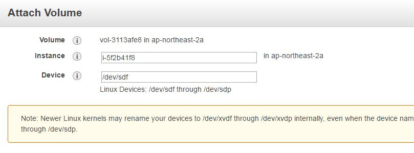

# VectorByTE WebApp and Database Admin Documentation 


# Database Rationale

This document exists in part to provide a guide to the PostgreSQL db layout, and as an explanation for why various decisions have been made.

## Schemas

The database is split into a multitude of schemas, each with their own content and purpose.

| Schema    | Purpose        |
| --------- | -------------- |
| vectraits | VecTraits data |
| vecdyn    | VecDyn data    |

### User Permissions

**THIS IS A TODO**

Each user in the database should have differential access to different schemas. Geo and tax should be accessible by all other users, whilst vectraits and vecdyn should be accessible only to the appropriate users, so we keep data segregated. vbdp should probably just be independent of the others.

## VecTraits Rationale

Vectraits is split into a number of tables to prevent serious data duplication.

### Table hierarchy

```
.vectraits
└── maintable
    ├── experimentalconditions
    ├── taxonomy
    ├── studylocation
    ├── sourceinfo
    │   ├── citation
    │   └── contributor
    └── traitdescription
```

The main-table stores each trait observation along with associated metadata. Any metadata duplicated often (such as publication information) is stored in a separate table, and referenced by id.

### The published_data view

This database view (different from a view in Web2Py) provides easy access to a certain subset of the data, namely any data which is both published and has an embargo release date in the past. Whilst on the backend this is just a query preappended to any query run against the database via the view, to Web2Py this view is presented as a separate table.

This layout has the advantage of restricting access to banned data at a very low level, reducing the likelihood for information leaks as Web2Py literally doesn't know about some of the data via this dbview.

## Getting started: installing software on your Ubuntu installation and setting up VectorBite Data Platform web-app and database locally (ordinal) 

### Install the following software:

- Python 2.7 (Programming language)
- PyCharm Professional  (Integrated programming development environment for web2py)
- Postgres 9.6 (Relational database management system) inc. Pgadmin4 
- KeepSafe2 (Password manager)
- Git (Version control system)
- Gitkraken (Git GUI Client for managing version control system)
- Filezilla (FTP client for uploading / downloading files to and from server)

#### Special installation instructions

You will need to install the latest version of Filezilla to ensure it works smoothly with AWS. At the time of writing the current release is FileZilla 3.46.3. You will need to adapt this tutorial accordingly for later releases.  

##### Build and install latest version of Filezilla from source:

Install the prerequisites for installing from source:

```
sudo apt install build-essential wx-common libpugixml-dev libsqlite3-dev libwxgtk3.0-dev nettle-dev gnutls-bin libgnutls28-dev
```

Download `libfilezilla-0.19.3` that is needed from https://lib.filezilla-project.org/download.php. *NOTE: Only `libfilezilla-0.11.0` is available in the Ubuntu 18.04 LTS repositories.*

Then extract, build and install:

```
tar -xvjf libfilezilla-0.19.3.tar.bz2 
cd libfilezilla-0.19.3/
./configure
make
sudo make install
```

Now get the source for Filezilla 3.46.3 from https://filezilla-project.org/download.php?show_all=1

Then extract, build and install:

```
tar -vxjf FileZilla_3.46.3_src.tar.bz2 
cd filezilla-3.46.3/
./configure
make
sudo make install
```

With the lib installs you might get the following message if it doesn't start:

> filezilla: error while loading shared libraries: libfilezilla.so.0: cannot open shared object file: No such file or directory

To fix it, simply run

```
sudo ldconfig 
```

You may also find you need to install missing packages before the "make" command will execute,  this is will because you need to install additional packages. You will be informed of which packages are missing after running the "./configure" command. 

### Create Accounts

- Create a GitHub account


### Pycharm:  Create Web2Py project

1. From the main menu, choose File | New Project..., or click the New Project button in the Welcome screen. New Project dialog opens.
2. In the New Project dialog, do the following:
3. Specify project type Web2Py.
4. Specify project location, make the final entry ‘vectorbite’, for example  ‘home/user/PycharmProjects/vectorbite’
5. Next, click Expand the node to expand the Project Interpreter node, and select the new environment or existing interpreter, by clicking the corresponding radio-button.
6. The following steps depend on your choice:
7. New environment using: if this option has been selected, choose the tool to be used to create a virtual environment. To do that, click the list and choose Virtualenv, Pipenv, or Conda.
8. Next, specify the location and base interpreter of the new virtual environment. If necessary, click the Inherit global site-packages and Make available to all projects check boxes.
9. When you configure a project Python interpreter, you need to specify the path to the Python executable in your system. So, before configuring a project interpreter, you need to ensure that you've downloaded Python and installed it in your system and you're aware of a path to it. You can create several project interpreters based on the same Python executable. This is helpful when you need to create different virtual environments for developing different types of applications. For example, you can create one virtual environment based on Python 3.6 to develop Django applications and another virtual environment based on the same Python 3.6 to work with scientific libraries.
10. Existing interpreter: if this option has been selected, choose the desired interpreter from the list, or (if the desired interpreter is not found), click Open and choose the interpreter. See Configure a Python interpreter for details.
11. When PyCharm stops supporting any of the outdated Python versions, the corresponding project interpreter is marked as unsupported Python interpreter
12. Click More settings (More Settings), and specify the following:
13. Application name (leave lank)
14. If necessary, select the Use local Web2Py checkbox. With this checkbox selected, the text field next to this checkbox become enabled. Click the browse button to select Web2Py source folder from your file system.
15. Click Create.
16. PyCharm creates an application and produces specific directory structure, which you can explore in the Project tool window. If there are unsatisfied requirements, PyCharm suggests to resolve or ignore them.

### Install python plugins via PyCharm

To manage Python packages for the project interpreter, select the Project Interpreter page in the project Settings/Preferences or select Interpreter Settings in the Python Interpreter widget.

| Required Packages | Version |
| ----------------- | ------- |
| PyYAML            | 5.1.1   |
| mkdocs            | 1.0.4   |
| psycopg2-binary   | 2.7.    |

### Web2py Scheduler

PycharmProjects/vectorbite/web2py$ python web2py.py -K VectorBiteDataPlatform


### Open passwords & certificates in KeepSafe2

1. Open KeepSafe
2. Go to file > open and select the ‘**Vectorbyte_KP_Database.kdbx**’ file
3. Log in with provided password
4. Don’t close the app! you’ll need access entries in the next steps

### Grant your personal GitHub account admin rights to access/edit the VectorBiteDataPlatform

1. Log in to https://github.com/ using the details found in Keepsafe  ‘GitHub’ > ‘Vectorbite GitHub account’ 
2. In GitHub, go to vectorbite/VectorBiteDataPlatform/settings/access.
3. Click on ‘Invite teams or People’.
4. Add your personal GitHub user name and set to admin.
5. You may need to accept a notification in your Git-hub account. Log back in to your account and check if you have any notifications pending. If so accept the invitation.   

### Download Vectorbite web-app and initialise git in GitKracken

1. Open Gitkraken and go to -  file > Clone Repo

2. Select GitHub.com

3. In ‘where to clone to’ click on ‘Browse’ to locate the web2py ‘vectorbite’  folder you set up (using pycharm) in previous steps, then navigate to and select the applications folder e.g. 

   ```
   '/home/user/PycharmProjects/vectorbite/web2py/applications/
   ```

4. In ‘Repository to clone’ select ‘VectorBiteDataPlatform’. The Full URL is https://github.com/vectorbite/VectorBiteDataPlatform.

5. Hit ‘Clone this repo’!

### Copy 'appconfig.ini' and 'VectorBite.pem files to application folder

#### Copy 'appconfig.ini' file.

1. In Keepass2, locate the appconfig.ini file in **Web2py > VectorbiteApplication configuration > advanced – file attachments.**

2. Open the file and save it to the 'private' folder located in the ‘VectorBiteDataPlatform’ application folder: 

   ```
   /home/user/PycharmProjects/vectorbite/web2py/applications/VectorBiteDataPlatform/private/
   ```

Copy 'VectorBite.pem' file.

1. Open up Filezilla and KeePass2

2. In Keepass2, locate the  "VectorBite.pem" file in  AWS > "AWS logon,  Public DNS + PEM" >  advanced > file attachments.

3. Open the file and save to the 'private' folder in the ‘VectorBiteDataPlatform’ application folder:

   ```
   '/home/user/PycharmProjects/vectorbite/web2py/applications/VectorBiteDataPlatform/private/' 
   ```


### Get database dump (back-up) files: Connect to Amazon EC2 file directory using FileZilla and SFTP

You need to set up your connection so you can upload and download files to and from the AWS server  (database backup files are stored here).

1. In Filezilla, go to Edit (Preferences) > Settings > Connection > SFTP, Click "Add key file”

5. Browse to the location of the "VectorBite.pem" in the ‘VectorBiteDataPlatform/private’ application folder and select it.

6. A message box will appear asking your permission to convert the file into ppk format. Click Yes, then give the file a name and store it somewhere.

7. If the new file is shown in the list of Keyfiles, then continue to the next step. If not, then click "Add keyfile..." and select the converted file.

8. File > Site Manager Add a new site with the following parameters:

   - Host: Your public dns name of ec2 instance, or the public ip address of the server. This is found in 

     ```
     Keeppass2 > AWS > "AWS logon,  Public DNS + PEM" >  URL.
     ```

   - Protocol: SFTP

   - Logon Type: Normal

   - User: ubuntu

  - Note from the docs: "For Amazon Linux, the default user name is ec2-user. For RHEL5, the user name is often root but might be ec2-user. For Ubuntu, the user name is ubuntu. For SUSE Linux, the user name is root. For Debian, the user name is admin. Otherwise, check with your AMI provider."

9. Press Connect Button - If saving of passwords has been disabled, you will be prompted that the logon type will be changed to 'Ask for password'. Say 'OK' and when connecting, at the password prompt push 'OK' without entering a password to proceed past the dialog.

Note: FileZilla automatically figures out which key to use. You do not need to specify the key after importing it as described above.

## Get dump SSl


### Download Postgres database dump file to load / restore databases 

Next we need to download the database back up files (known as dump files) so we can load the database onto your local machine. 

1. Open Filezilla
2. Connect to the AWS server using log-on details outlined in the previous step
3. Navigate  to /home/ubuntu/vdbp_installation on the remote site. 
4. Download the latest versions entitled "vecdyn.pgdump" & "vectraits.pgdump" 
5. Search for the latest versions of the database  dumps by clicking on last modified. 

### Load/restore Postgres database

Required applications: pgAdmin & KeePass2*

You need to create the following group roles before you can restore the databases. 

1. ​	In the left hand pane, go to: ***Servers > PostgreSQL 9.6 > Login/Group Roles***
2. ​	Right click ***> Login/Group Role***
3. ​	General > Name enter username found in ***PostgreSQL 9.6 / pgAdmin 4 > vecdyn login / group role***
4. ​	Definition > Password found in ***PostgreSQL 9.6 / pgAdmin 4 > vecdyn login / group role***
5. ​	Privileges > set all icons to yes
6. ​	Membership > Roles **> add  *"admin" & "postgres"***
7. ​	Hit save
8. ​	Repeat the same step and create a ***"vectraits" login / group role.*** 

Restore Databases (either vecdyn or vectraits)

1. ​	In the left hand pane, go to: ***Servers > PostgreSQL 9.6 > Databases***
2. ​	Right click and ***create > Database***
3. ​	Under the *general >* Database Field write "**vectorbitedb**" and hit save. 
4. ​	Right click on the "**vectorbitedb**" and select Restore.
5. ​	Under file name select the "**vecdyn.dump**" or "**vectraits.dump**" file (you may need to change the format to All Files)
6. ​	Hit **Restore


## Common Tasks and operations

### Connecting to AWS server via SSL using Ubuntu terminal

Open the Keepass2 and adapt the code found in "*AWS SSH connection details > Notes*" to work with your personal paths and directories. 

Example code:

```
sudo ssh -i '/home/user/web2py/applications/yourapp/yourpem.pem'  ubuntu@ec2-198-51-100-1.compute-1.amazonaws.com 
```

Enter the code in the Ubuntu terminal, if connection has been successful you will receive the following welcome message in the terminal. 

    Welcome to Ubuntu 16.04.6 LTS (GNU/Linux 4.4.0-1084-aws x86_64)
    
    - Documentation:  https://help.ubuntu.com
    - Management:     https://landscape.canonical.com
    - Support:        https://ubuntu.com/advantage
    
      Get cloud support with Ubuntu Advantage Cloud Guest:
    http://www.ubuntu.com/business/services/cloud

### Backup database (create dump of current version)

To create a backup of the entire database use the following example: 

- Move into the installation folder:

  ```
  cd vdbp_installation/
  ```

- Create the backup

  ```
  /usr/bin/pg_dump  --dbname=vectorbitedb --schema=vecdyn --format=c  --username=vecdyn  --file=vecdyn_ENTER-DATE-HERE.pgdump --host=127.0.0.1 --port=5432
  ```

- Confirm the file has been created in the installation folder

  ```
  zip -9 fulldump_120220.zip fulldump_120220.pgdump 
  ```

- You can download all archived files from ec2 using FileZilla or via SSL

### Updating Live Web-app from GitHub Master

```
cd /home/www-data/web2py/applications/VectorBiteDataPlatform/
ll
git status
sudo git stash
git pull
sudo service apache2 reload

```

### Release Procedure

*On Local*

- Finish features
- Start release branch
- Add and commit release notes
- Finish release branch
- `git push`

*On LIVE*

- `git status`
- Check and resolve any diffs
- `git reset --hard HEAD` (or `git stash`)
- `git pull`
- Make any changes out of repo (e.g. in /private or ~/web2py)
- Modify version number in appconfig.ini
- Restart server if needed

 *Finally*

 - Move appropriate cards in Trello to Done
 - Resolve any Bitbucket/github issues and tag with release merge commit

## Logging details and notebook

There are four levels of logging in python: `DEBUG`, `INFO`, `WARNING` and `ERROR`. Below is an example of how to use each level in python, along with a brief style guide for their usage in the QMEE CDT webapp.

### `DEBUG`

`logger.debug("Something minor")`

The `DEBUG` level is the lowest log level. It is used to provide detailed information about the application state and data flow for the purposes of debugging and bug recreation. This should be used for any direct logging of arguments and form data (formatted or otherwise), but be aware that in normal execution conditions, this will not show up in the logs.

### `INFO`

`logger.info("Something of interest")`

The `INFO` level is used for information which the system administrator probably should know about. This should be normal app behaviour, including normal responses to user error. Most logging is done at either this level or at `DEBUG`. Note that the convention presently implemented is that any action which includes a write to the DB should be logged with an `INFO` level log, e.g. submission of proposals or new PIs.

Sometimes it may be nice to put a notification of incorrect user input at the `INFO` level, followed by more detailed information at the `DEBUG` level, e.g.:

```python
logger.info("Form errors: {}".format(len(form.errors)))
logger.debug("in the following fields: {}".format(form.errors.keys()))
```

Which would write the following to the log:

```
22-10-18 18:12:16 - INFO    - add_proposal - Form errors: 16
22-10-18 18:12:16 - DEBUG   - add_proposal - in the following fields: ['training', 'proj_realworld', 'project_description', 'nerc_relevance', 'project_title', 'proj_quant', 'training_loc', 'proj_innov', 'quant_superv', 'case_partner', 'expertise', 'PI2_name', 'multidisciplinarity', 'PI_name', 'proj_evoeco_theory', 'proj_transform']
```

### `WARNING`

`logger.warning("Something went a bit wrong")`

The `WARNING` level is designed for execution states outside of the usual. When a form has returned something outside of the usual, or if a database seems to be lacking an auxiliary table, this should be a `WARNING`. Anything tagged as `WARNING` should be recoverable from for the application.

### `ERROR`

`logger.error("Something is seriously broken!")`

The `ERROR` level is reserved for potentially system-breaking errors. If a form fails to return anything, or a database is impossible to reach, we should be seeing `ERROR` messages in the logs!

#### `EXCEPTION`

`logger.exception("An unhandled exception occurred:")`

The `EXCEPTION` level is a subclass of the `ERROR` level with a bit of extra magic. When executed in the context of a caught exception, this will return not only the message provided, but also the stack trace generated by the exception. This can be used in the following context to catch and log all exceptions before raising them up to the next level:

```python
try:
    foo()
except Exception:
    logger.exception("An unhandled exception occurred")
    raise
```

## Updating Live Web-app from GitHub Master

```
cd /home/www-data/web2py/applications/VectorBiteDataPlatform/
ll
git status
sudo git stash
git pull
sudo service apache2 reload

```


## VectorBiTE deployment on AWS

### Creating the AWS virtual machine and web interface

The overview is:

1. Create and Amazon EC2 instance
2. In order to enable HTTPS, we're using the LetsEncrypt software and certification authority.
3. The DB backend for the website is running in PostgreSQL on the local server. 

### EC2 setup

Logon to the AWS account, go to  EC2 account and then launch a new EC2 instance running linux: We have  used Ubuntu 18.04 LTS for this tutorial.  

This is all done through the browser UI.  Make sure to tag the instance with the name 'VBDP-SYS', as this tag is used to identify the server instance for some of the automatic steps below. Also make sure you setup the security rules to allow the server to listen to all HTTP, SSH and HTTPS requests. The website will redirect http to https but we'll get to that later.

This gives you a virtual server, and in the process of creating it you'll get a key file (.pem), that allows you to connect to the server remotely via SSH. This allows you to then set up other aspects of the server:

A key pair consists of a public key that AWS stores, and a private key file that you store. Together, they allow you to connect to your instance securely. 

Note: You already have access to the 'Vectorbite.pem' in your KeepSafe database. 

1. Once a VM instance is up and running, it has some hard drive space and an IP address, so you can theoretically run everything from there. But... you need to think of them as temporary and substitutable: the disk space associated with the root device on an instance does not persist if the instance is shut down **nor does the IP address**. So you can run everything from it, but if the instance is stopped for any reason, you've got to start over and you've probably lost data.
   So, we need a couple of extra resources:
2. A data volume which we can attach to our VM instance. This then acts as a drive that the VM can use
   for storage but it also persistent: if the VM goes down, the attached volume is preserved. It can also
   be backed up automatically to provide recovery (see below).
3. ** An elastic IP**, which is a mechanism to link the IP of a VM instance (lost at VM shutdown) to a
   permanent IP. In the event of a crash, you can switch the VM linked to the IP to the new VM and
   carry on as before.

So. First, connect to the EC2 Instance and install some tools. For reproducability, the AWS command line interface is used to set up these components.

Open the Keepass2 and adapt the code found in "*AWS SSH connection details > Notes*" to work with your personal paths and directories. 

Example code:

```
# EC2 instance connection
chmod 400 yourpem.pem
sudo ssh -i '/home/matt/web2py/applications/yourapp/yourpem.pem'  ubuntu@ec2-198-51-100-1.compute-1.amazonaws.com 
```

Note that this file contains the keys to the whole server - it should not be saved anywhere publicly accessible or shared with people outside the project admin.

### Set up command line tools

We need to install the command line tools from apt-get and then configure them. You'll need the user credentials associated with your EC2 account to configure the tools.

### Access keys (access key ID and secret access key)

Use access keys to make programmatic calls to AWS from the AWS CLI, Tools for PowerShell, the AWS SDKs, or direct AWS API calls. You can have a maximum of two access keys (active or inactive) at a time. [Learn more](http://docs.aws.amazon.com/console/general/signing)

https://www.stratoscale.com/knowledge/compute-2/compute-tools/boto-3-for-ec2/create-vm-create-volume-attach-volume-to-vm/

https://www.bogotobogo.com/DevOps/AWS/aws_creating_an_instance_and_attaching_Amazon_EBS_volume_to_that_instance_bogo_Python_module.php

```
# install pip and a python package to script tools
sudo apt-get update
sudo apt-get install python-pip
```

```
To see everything that’s installed in your instance, type in the following commands:
cd/usr/bin/
ls
```

### Creating the data volume

We now need to set-up a new Elastic Block Storage (EBS) volume, which is basically a hard drive that works directly with your VM instance. The free tier for AWS comes with 30GB of EBS storage and the default VM uses 8GB (which might be excessive), so this can be ~20GB without running up costs. It then attaches it to the instance tagged with the name VBDP-SYS.

```
python launch_and_attach_data_volume.py
```

To attach an EBS volume to an instance using the console

1. Open the Amazon EC2 console at https://console.aws.amazon.com/ec2/.

2. In the navigation pane, choose Elastic Block Store, Volumes.

3. Select an available volume and choose Actions, Attach Volume.

4. For Instance, start typing the name or ID of the instance. Select the instance from the list of options (only instances that are in the same Availability Zone as the volume are displayed).

5. For Device, you can keep the suggested device name, or type a different supported device name. For more information, see Device Naming on Linux Instances.

6. Choose Attach.

7. Connect to your instance and mount the volume. For more information, see Making an Amazon EBS Volume Available for Use on Linux.

## Mount an EBS volume to EC2 Linux

In this tutorial, we will teach you how to  attach and mount an EBS volume to ec2 linux instances. Follow the steps given below carefully for the setup.

**Step 1:** Head over to EC2 –> Volumes and create a new volume of your preferred size and type.

**Step 2:** Select the created volume, right click and select the “attach volume” option.

**Step 3:** Select the instance from the instance text box as shown below.

**Step 4:** Now, login to your ec2 instance and list the available disks using the following command.



```
lsblk
```

The above command will list the disk you attached to your instance.

**Step 5:** Check if the volume has any data using the following command.

```
sudo file -s /dev/xvdf
```

All  files  accessible  in a Unix system are arranged in one big tree, the file hierarchy,
rooted at /.  These files can be spread out  over  several  devices.   The  mount  command
serves  to  attach  the filesystem found on some device to the big file tree.  Conversely,
the umount(8) command will detach it again.  The filesystem is used to control how data is
stored on the device or provided in a virtual way by network or another services.

The standard form of the mount command is:

      mount -t type device dir

This  tells the kernel to attach the filesystem found on device (which is of type type) at
the directory dir.  The option -t type is optional.  The mount command is usually able  to
detect a filesystem.  The root permissions are necessary to mount a filesystem by default.
See section "Non-superuser mounts" below for more details.  The previous contents (if any)
and  owner  and  mode  of  dir  become  invisible,  and as long as this filesystem remains
mounted, the pathname dir refers to the root of the filesystem on device.

The volume now exists as a device (/dev/xvdf) on the instance, but doesn't have a file system and isn't mounted. So:

```
sudo mkfs -t ext4 /dev/xvdf

sudo mkdir /home/www-data

sudo mount /dev/xvdf /home/www-data
```

### Installing web2py

This downloads and runs a web2py script that sets sets up web2py,  postgres, postfix and a bunch of other stuff and restarts Apache. This  installation therefore sets up a machine that could run its own internal DB and mailserver, although AWS try to get you to use their RDS  service, which isn't available for free.

```
cd /home/www-data
sudo wget https://raw.githubusercontent.com/web2py/web2py/master/scripts/setup-web2py-ubuntu.sh
sudo chmod +x setup-web2py-ubuntu.sh
sudo ./setup-web2py-ubuntu.sh
```

As part of this script you have the opportunity to configure postfix  for email (hit  the "tab" button on your keyboard and choose "None" in the configuration options) and to configure a  SSL certificate to allow HTTPS. This self-signed certificate is  basically worthless.

you may get asked to complete apache config information. leave this blank by pressing enter

You then need to set the password for the admin web2py app to enable  admin access via the web interface, which involves running a command  from within the web2py python modules (note that the current password is found in the Keepass database: 

```
cd /home/www-data/web2py
sudo -u www-data python -c "from gluon.main import save_password; save_password(raw_input('admin password: '),443)"
```

### PostgreSQL

At the time of writing, the AWS Ubuntu is 18.04 LTS, comes with installs psql 10.12, you can check the version by typing 

```
sudo -u postgres psql
```

At this point, we should have a webserver running web2py with the  default applications. However at the moment, it is only accessible via  the Public DNS of the VM instance. If you copy that from the EC2 console into the browser, you should see the welcome to web2py application.

If you try going to https://%3Cpublic dns>, you'll get warnings about the certificate not being trusted.  We need a proper certificate from a trusted authority to enable HTTPS  but before we do that, we'll get the web application up and running.

# Database deployment procedure

This document describes the release procedure for the VBDP postgres database

## 0. Kill the previous database if required

Firstly you may wish to kill the previous database. To do this you will probably need to stop the apache server using `sudo service apache2 stop` on the server (ssh in as usual).

Next run `sudo su postgres` to switch to the postgres ubuntu user and run `psql` to connect to the main server as the superuser.

Now run `DROP DATABASE vectorbitedb;` to kill the db, and run the following to drop all users.

``` sql
DROP ROLE IF EXISTS geo;
DROP ROLE IF EXISTS tax;
DROP ROLE IF EXISTS vbdp;
DROP ROLE IF EXISTS vectraits;
DROP ROLE IF EXISTS vecdyn;
DROP ROLE IF EXISTS vbadmin;
```

This should leave you in a position to run the setup scripts as usual.

---

## 1. Create the DB, superuser, schemas & users

A lot of this has now been scripted, so simply put you just need to connect to the main aws server as postgres and run the `create_vbdp_db_pt1.sh` script (location tbc).

This will set up the db structure ready for data import

## 2. Data import

Importing data for the first time will seem to generate a few errors, as the pgdump file contains sql to try to drop the tables of the schema if they exist. As they do not exist, it'll throw some errors though this should be nothing to worry about.

To import the data, use the following command **from the main ubuntu user**:

`/usr/bin/pg_restore --dbname=vectorbitedb --schema=<SCHEMA> --clean --username=<USER> --host=127.0.0.1 --port=5432 /path/to/dump.pgdump`

So if I was importing `vectraits_270219.pgdump` from the pgdumps folder on LIVE into the `vectraits` schema, I would use the following command:

`/usr/bin/pg_restore --dbname=vectorbitedb --schema=vectraits --clean --username=vectraits --host=127.0.0.1 --port=5432 /home/ubuntu/pgdumps/vectraits_270219.pgdump`

This pgdump file should also create any constraints and views applied to the original db it was taken from. Thus once this is complete we just need to get VBDP to pick up the data.

## 3. Fake migration

In order to get Web2Py to work out that the data has change, we need to force a fake migration. Firstly restart apache2 if necessary using `sudo service apache2 start`.

Next navigate to the `/home/www-data/web2py/applications/VectorBiteDataPlatform/models` directory and open the `db.py` file. Find the line that defines the connection to the relevant schema e.g.

``` python
db = DAL(configuration.get('db.uri'),
             pool_size=configuration.get('db.pool_size'),
             migrate_enabled=configuration.get('db.migrate'),
             lazy_tables=True,
             # fake_migrate_all=True,        # Allow fake migration to rebuild table metadata
             check_reserved=['sqlite'])
```

Uncomment the `fake_migrate_all` line and then try to open a view which depends on the db you just restored.

If that all works correctly, uncomment the `fake_migrate_all` line and you should be done.

In future this last step will be spun out to the appconfig.ini file, so no changes to the code will be required. 

## Deploying the web application

This is basically just a matter of cloning the repository and then  setting up the configuration for the application running on this server.

### Install python modules

The application needs a few extra python modules. I didn't muck  around with virtualenv for packages as these ones should probably should be globally available rather than just for the user www-data. I needed:

```
sudo pip install gitpython 
sudo pip install --upgrade google-api-python-client
sudo pip install xlrd
sudo pip install html2text
sudo pip install lxml
sudo pip install pandas
sudo pip install psycopg2-binary
sudo pip install mkdocs
sudo pip install psycopg2
```

### Initial deployment

Install git:

```
sudo apt-get install git
```

Now clone the repo into the web2py applications folder. You could set up SSH, which gives the advantage of not needing to provide a password  every time. However it is a pain to set up the keypairs and you'd expect that there are  going to be relatively infrequent roll outs of updated  versions. So go with an clone via https, requiring your bitbucket  password:

```
cd /home/www-data/web2py/applications
sudo -u www-data git clone https://github.com/vectorbite/VectorBiteDataPlatform.git
```

Before the application can work, we need to setup the database backend and edit the `appconfig.ini` file for the application to point to this database and to the correct SMTP server to send mail, this file can be found in the KeepPass2 database. 

## Updating Live Web-app from GitHub Master

```
cd /home/www-data/web2py/applications/VectorBiteDataPlatform/
ll
git status
sudo git stash
git pull
sudo service apache2 reload

```


