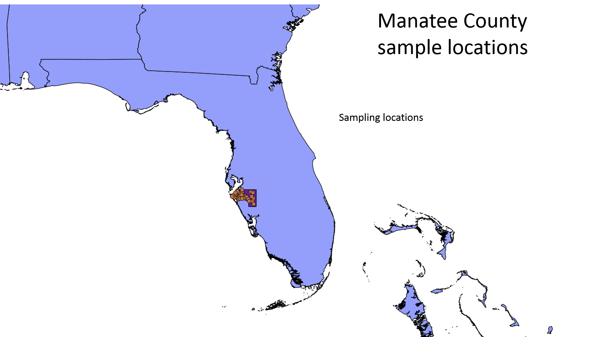

## Data Storage and Data Collection Specifications

The following section provides an overview of the database structure and 

## VecDyn Database structure (backend)

The following image shows the database schema, this describes where the data is stored in the database, relationships between tables and the database structure.

The database back-end consists of five tables:

The **Publication Information Table**  captures general information about the data-set e.g. titles,  descriptions,  who collected the data and data usage rights.

The **Study Meta Data Table** captures information describing what was collected or observed, how this was achieved,  and general details about where sampling took place. Data in this table captures information that tends to be repeated in population abundance data-sets, therefore storing this information once saves storage space improving the scalability of the database.

The **Time Series Data Table** captures all the information required to produce a Time-Series. Each row should represent a separate observation, at a particular point in time and provide a value for the entity sampled. This table can also capture detailed temporal and spatial information about a sample/observation site e.g. specific coordinates of a trap, environmental characteristics or specific weather conditions at the time of sampling.

The **Taxonomic Information Table**  is a database table which is used to standardise all  taxonomic information uploaded into the database. It has been adapted from [GBIF Backbone Taxonomy](https://www.gbif.org/en/dataset/d7dddbf4-2cf0-4f39-9b2a-bb099caae36c), which is the most comprehensive and authoritative global index of species currently available. This enables  front-end search (querying) facilities to use internationally recognised naming conventions thus improving the usability of the web application.

The **Geographic Database Table** is used to standardise all geographic information that is stored in the database. [The Global Administrative Unit Layers (GAUL) 2014 ](http://www.fao.org/geonetwork/srv/en/metadata.show?id=12691) data-set is a spatial database that systematises global administrative regions with a unified coding system at country, first (e.g. departments) and second administrative levels (e.g. districts). Each Administrative unit is assigned a unique ID and is connected to a spatial polygon. Standardising  geographic information will allow users to query data spatially or by using a structured keyword search facility.

## Temporal referencing

Temporal referencing in the VecDyn database has been kept as straightforward as possible.
Collection fields are set up to gather information on the date-time a collection was started
and the date-time a collection ended.  Using this information it is easy to calculate information
like the duration a trap was set or to calculate the duration of other relevant sampling methods
like ecological belt transects or line transects.

## Spatial referencing

In order to facilitate mapping and geo-spatial analysis, spatial referencing has been set up to track general information about a study site e.g. country, region, municipality and also specific information about a sample site, where Global Positioning System (GPS) information can be inputted for each collection site. The following figures demonstrate the spatial information that can be captured per study. For example, such data will allow the user to make assessments about sampling effort and decide whether data it is representative of a region or can use it to overlay against environmental and demographic covariates.

