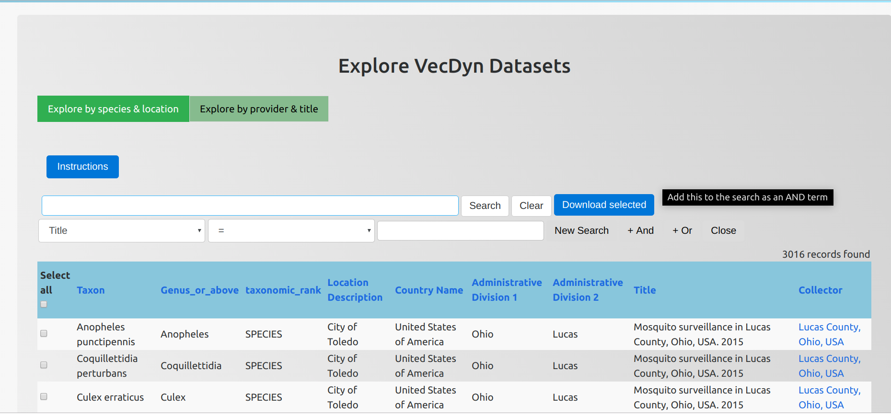
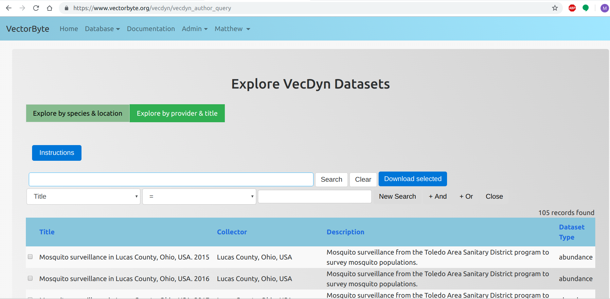

## Query by location and taxonomy

You can search for data by entering keywords related to taxon, geography or a collector e.g. 'Imperial College'

To conduct a quick search, enter keywords e.g. taxon name into the search box in the first row, just enter a keyword and hit search!
If you need to conduct an in-depth search you can use the query builder in the second row.

1. In the left box select which element of the data set you wish to search e.g. title, taxon name (note geographic subdivision names start with ADM)
2. In the middle box select which Boolean Operator you wish to use for the search
3. In the right box enter the keyword
4. Hit 'New Search' to query, or '+ And' or '+ Or' to build a complex query
5. You'll now see your search terms in the first box, you should hit search here!
6. To download data either click on 'Download all' to download the entire search (limited to 10) or use the select checkbox on each right hand side row and click 'Download selected'.

## Query by dataset name, provider and keywords

You can search for data by entering keywords related to a data set or a collector e.g. 'Imperial College'

To conduct a quick search, use the search box in the first row, just enter a keyword and hit search!
If you need to conduct an in-depth search you can use the query builder in the second row.

1. In the left box select which element of the data set you wish to search e.g. title or collector
2. In the middle box select which Boolean Operator you wish to use for the search
3. In the right box enter the keyword
4. Hit 'New Search' to query, or '+ And' or '+ Or' to build a complex query
5. You'll now see your search terms in the first box, you should hit search here!
6. To download data either click on 'Download all' to download the entire search (limited to 5) or use the select checkbox on each right hand side row and click 'Download selected'.
