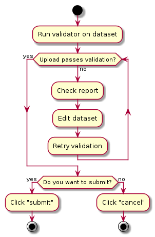

## Using and Abusing the Validator

Vectrait has a validation tool built in to allow a digitiser to quickly check whether their candidate dataset for upload is in the correct format. In order to submit a dataset to VectorByte it must first pass through the validator to check that it is canonical (as defined by the entries in the [field definitions](field_definitions.md) section.)

### The Guide
The validator has a simple workflow as follows:



To use the validator you must be logged in to VectorByte. Then click `Database > Validate` in the top menu bar. On this linked page there is a file upload dialog, with which you select and upload your dataset.

The validator should run relatively quickly, but validation time is dependent on the size of the dataset. Thus if you have uploaded a dataset of a few thousand rows, it may be worth taking a few minutes to go and get a coffee whilst the validation runs.

### The Report
If the validation fails, you will be returned a report in-line within the validator page:

Here is an example report from a test dataset which failed.
```
------------------------------------
  VALIDATION REPORT

    File name: testcsv_NACLEAN.csv
  File length: 3 rows
      Started: 29-07-19 10:45:11
------------------------------------

Validating row 1...
    Invalid column name: "interactiontype"
    Invalid column name: "climate"
    Invalid column name: "uid"
Validating row 2...
    Invalid column name: "interactiontype"
    Invalid column name: "climate"
    Invalid column name: "uid"
Validating row 3...
    Invalid column name: "interactiontype"
    Invalid column name: "climate"
    Invalid column name: "uid"

------------------------------------
  VALIDATION COMPLETE

         Ended: 10:45:11
        Errors: 9
  Failed lines: 3
  Time elapsed: 0:00:00.014881
------------------------------------

  COLUMN REPORT

"climate" failed on rows: [1, 2, 3]
"uid" failed on rows: [1, 2, 3]
"interactiontype" failed on rows: [1, 2, 3]
```

The problem here is simply that there are a few columns which are not canonical column names in VecTraits. In this scenario, simply deleting the offending columns would be enough to allow the dataset to be pushed through.

### Submission
Once the dataset has passed validation, you can click "submit" to submit it to the VectorByte team for upload. Once you have done this, you have no direct access to the data any more. However, if you do make a mistake, do just email the team and they should be able to identify and delete the offending dataset before upload.

**Important**: Please make a note of the **date** and **time** that you uploaded the dataset which you want discarded. This will make it a lot easier for the team to identify which dataset is yours.
